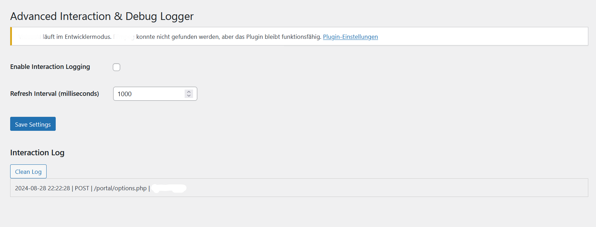
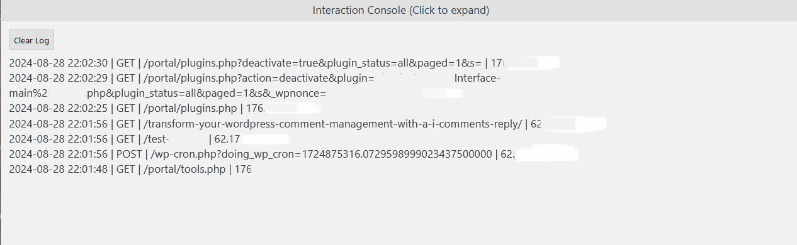

# Interaction & Debug Logger

## Description

**Interaction & Debug Logger** is a powerful WordPress plugin that allows real-time logging of user interactions and debug information. With an expandable console and an intuitive interface, this plugin is an essential tool for developers who want to monitor and analyze site activity directly from everywhere on your Wordpress site.

## Features

- **Real-time Logging:** Capture and display real-time logs of user interactions, page requests, and other activities.
- **Expandable Console:** An easy-to-use console at the bottom of your site that you can expand and collapse as needed.
- **Customizable Refresh Interval:** Set the refresh interval to control how frequently the logs are updated.
- **Clear Log Button:** Instantly clear the logs from the console and start fresh.
- **Filtered Logging:** Automatically exclude unnecessary logs, such as AJAX requests, to keep your logs clean and relevant.
- **Admin Dashboard Integration:** View and manage logs directly from your site where you are :smile:
## Installation

1. Download the plugin and unzip it.
2. Upload the `interaction-debug-logger` directory to your `/wp-content/plugins/` directory.
3. Activate the plugin through the 'Plugins' menu in WordPress.
4. Go to `Tools > Interaction Logger` to configure the settings.

## Usage

- **Enable Logging:** Navigate to the plugin's settings page under `Tools > Interaction Logger` and enable logging.
- **Set Refresh Interval:** Adjust the refresh interval to control how often the logs update in the console.
- **View Logs:** Interact with your site as usual, and watch the logs appear in the expandable console at the bottom of the screen.
- **Clear Logs:** Use the "Clear Log" button in the console to reset the logs.

## Screenshots

### 1. Settings Page

### 2. Expandable Console

### 3. Real-time Logging

## Changelog

### Version 2.5
- **NEW:** Reverse log order to show the latest entries at the top.
- **NEW:** Filter out unnecessary AJAX logs for cleaner data.
- **Improvement:** Enhanced UI for better accessibility and user experience.
- **Improvement:** Added "Clear Log" button directly in the console.

## Roadmap

- **Search and Filter Logs:** Add options to search and filter log entries directly in the console.
- **Email Notifications:** Send email alerts based on specific log triggers.
- **Advanced Log Export:** Export logs in various formats (CSV, JSON, etc.).

## Contribution

Contributions are welcome! If you have any suggestions or improvements, feel free to open an issue or submit a pull request.

## License

This project is licensed under the MIT License - see the [LICENSE](LICENSE) file for details.

---

**Happy logging with the Interaction & Debug Logger!**

